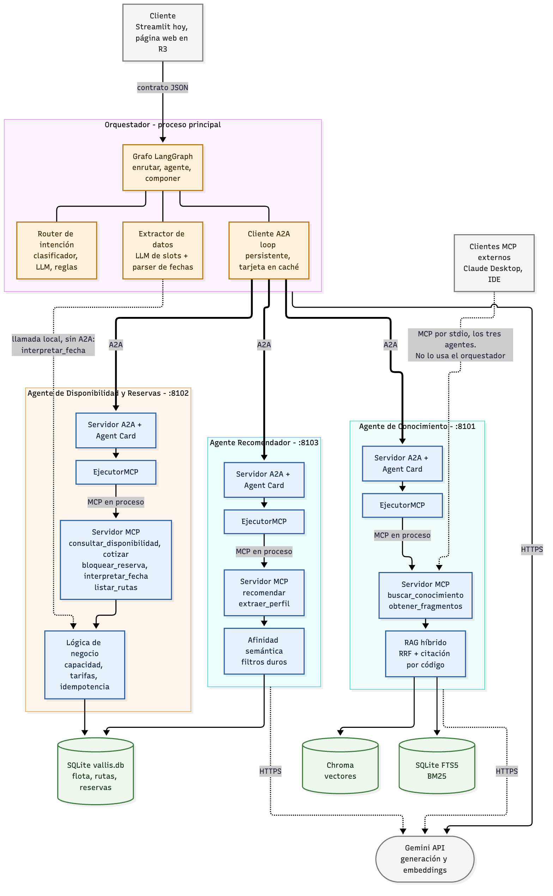
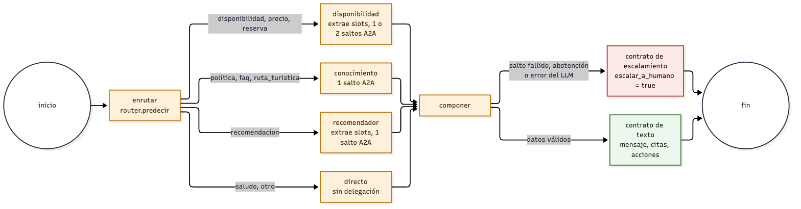
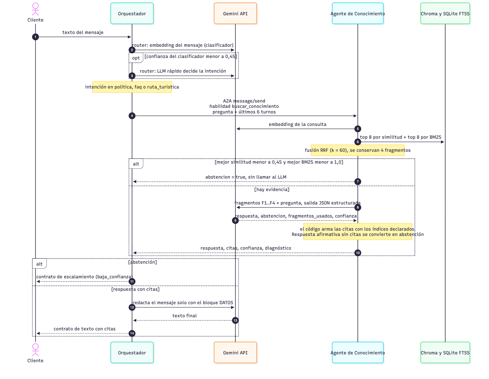
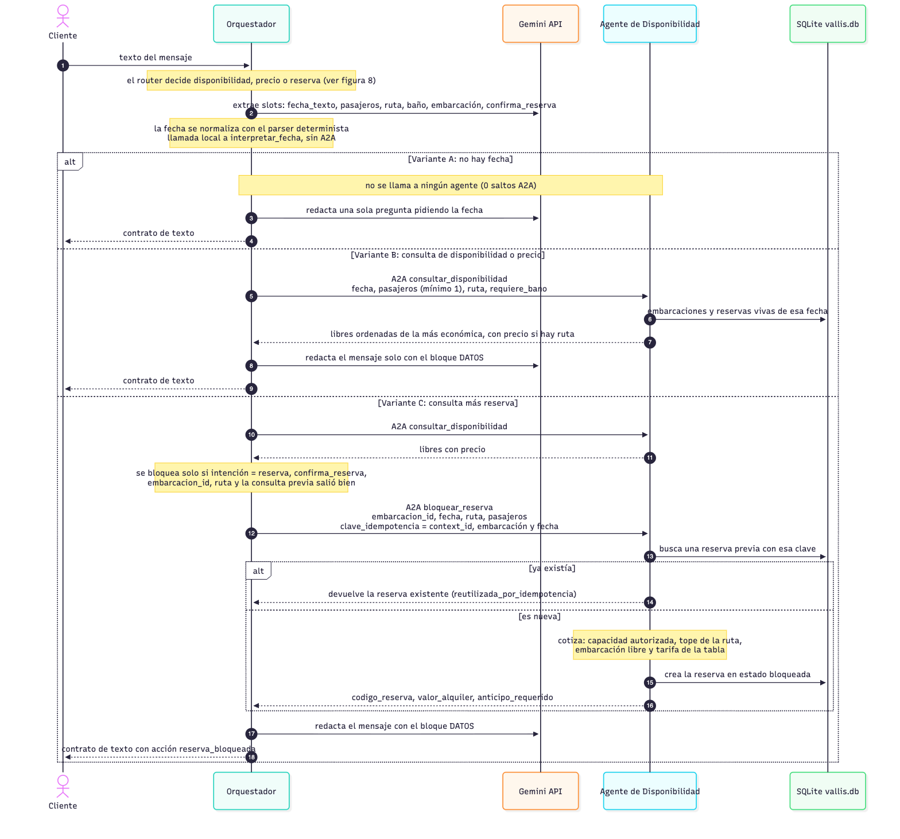
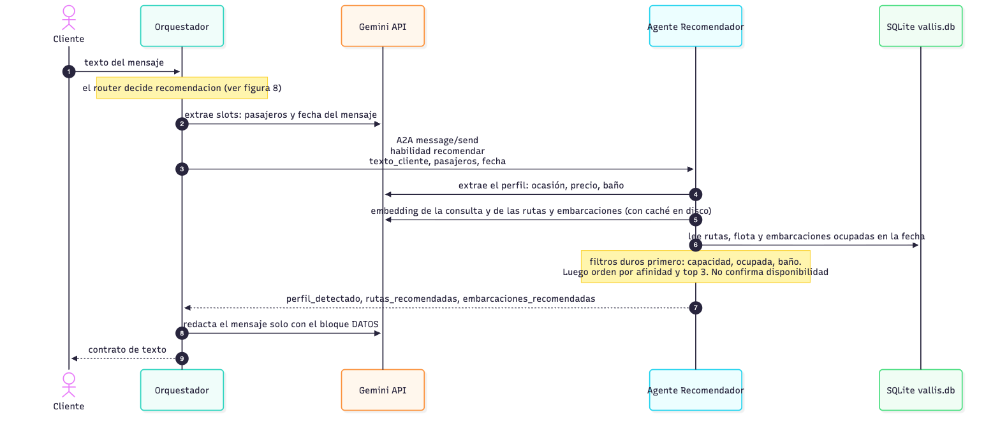
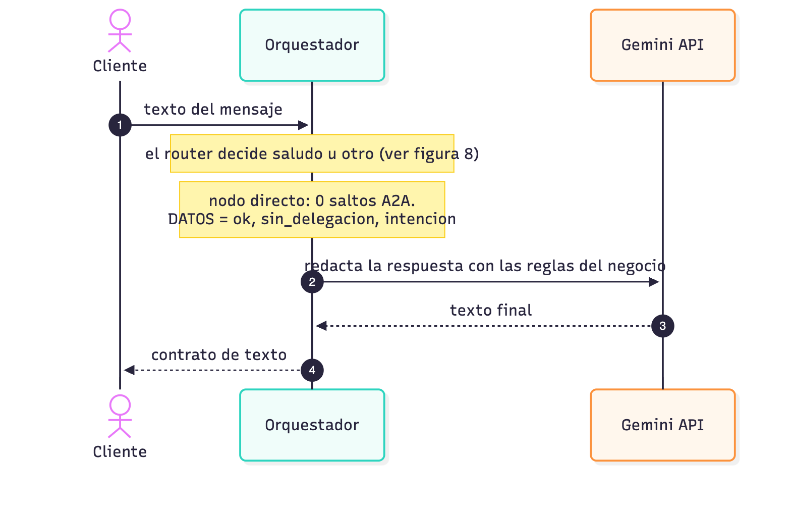
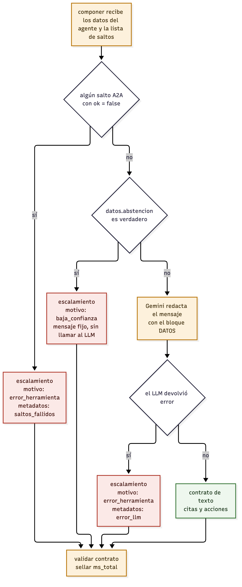
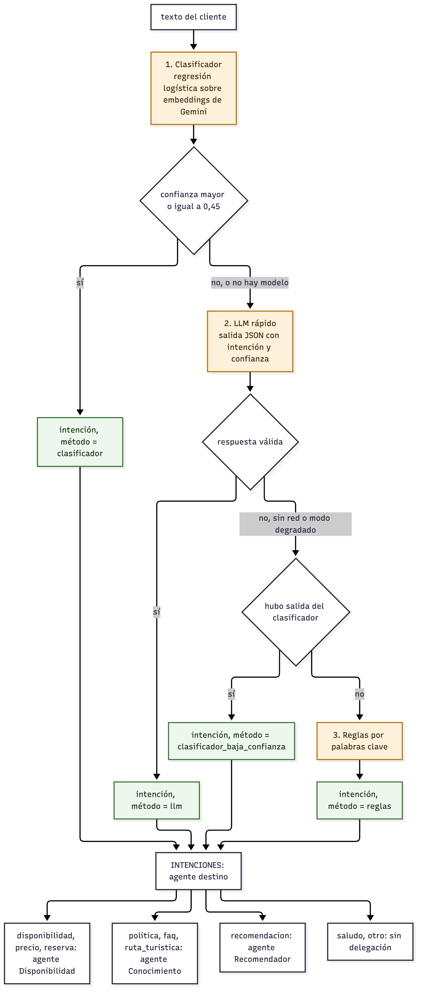
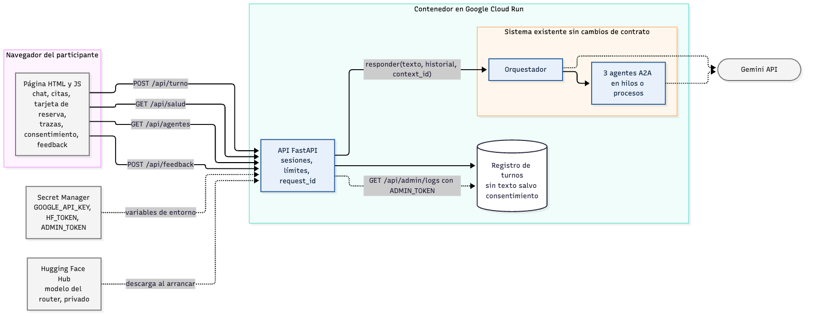

# Vallis Marea: de agente monolítico a ecosistema de agentes interoperables (MCP/A2A)

**Informe técnico final**
SI7016 Procesamiento del Lenguaje Natural Aplicado · Maestría en Ciencias de Datos y Analítica
Universidad EAFIT · 2026-2

**Equipo:** Elkin David Ortiz Rodriguez · Dilan Monsalve Monsalve · Juan David Trujillo Velez

---

## 1. Resumen

Vallis Marea es un chatbot multimodal **en producción** para un negocio de alquiler de lanchas
en Cartagena: AWS EC2 dockerizado, Caddy como proxy TLS, Chatwoot como bandeja unificada,
WhatsApp vía Meta Cloud API, webhooks a n8n, Postgres con pgvector y Redis. Recibe texto, voz
e imágenes y responde con texto, imágenes o PDFs.

Su limitación no es de capacidad sino de **arquitectura**: un único nodo de IA en n8n
concentra clasificación, conocimiento, disponibilidad y recomendación, sin separación de
responsabilidades ni comunicación formal entre capacidades.

Este trabajo descompone ese monolito en cuatro agentes que colaboran mediante **MCP** (Model
Context Protocol, para exponer herramientas y datos) y **A2A** (Agent-to-Agent, para que los
agentes se descubran y se deleguen tareas), y **mide qué se gana y qué se paga** con esa
migración.

**Hallazgo principal:** la interoperabilidad cuesta **+7,7 ms por delegación** (p50: 14,3 ms
por A2A contra 6,6 ms por llamada directa, +116,7 %), más un costo de arranque de
~0,37–0,43 s por agente para descubrir su Agent Card, que se paga una vez por sesión y no
por mensaje. A cambio se obtiene desacoplamiento real, reutilización de las capacidades por
clientes
externos y trazabilidad por salto.

---

## 2. Arquitectura

```
                  ┌──────────────────────────────┐
   Streamlit  ──► │  Orquestador (LangGraph)     │
   (app.py)       │   · router de intención      │
   + visor de     │   · memoria de conversación  │
     trazas       │   · cliente A2A              │
                  └──────┬───────────────────────┘
                         │  A2A (JSON-RPC sobre HTTP)
          ┌──────────────┼──────────────┐
          ▼              ▼              ▼
   ┌────────────┐ ┌────────────┐ ┌────────────┐
   │Conocimiento│ │Disponib. y │ │Recomendador│   cada uno:
   │  (RAG)     │ │ Reservas   │ │            │   · servidor A2A + Agent Card
   └─────┬──────┘ └─────┬──────┘ └─────┬──────┘   · servidor MCP con sus tools
      MCP│            MCP│           MCP│
         ▼               ▼              ▼
   Chroma + FTS5     SQLite        embeddings
   (políticas,      (flota,        del catálogo
    FAQs, rutas)     reservas)
```

La figura 1 muestra las fronteras reales entre componentes: qué cruza A2A (HTTP), qué cruza MCP
y qué es una llamada local. La figura 2 muestra el grafo del orquestador. El resto de las
figuras está en el Anexo A.





### 2.1 La decisión de diseño central

El ejecutor A2A de cada agente **no reimplementa nada**: despacha sobre el mismo servidor MCP
de ese agente (`core/a2a/servidor.py`, clase `EjecutorMCP`). Cada capacidad queda por tanto
publicada dos veces sin duplicar lógica:

- **MCP** → cualquier cliente compatible (Claude Desktop, un IDE, otro agente).
- **A2A** → el orquestador de Vallis Marea, o un agente de otro proveedor.

Esa dualidad es lo que hace verificable la promesa de la propuesta, y lo que permite medir el
desacoplamiento: la capacidad es una, los protocolos de acceso son dos.

### 2.2 El orquestador no sabe nada del negocio

No conoce precios, ni políticas, ni la flota. Sabe **a quién preguntarle** porque la tabla
`INTENCIONES` de `core/config.py` asigna cada intención a un agente, y sabe **qué habilidad
pedirle** porque cuatro nombres están escritos en `core/orquestador/grafo.py`:
`buscar_conocimiento`, `recomendar`, `consultar_disponibilidad` y `bloquear_reserva`.
Es la diferencia concreta contra el nodo monolítico que reemplaza: la lógica de negocio vive
en los agentes, no en el orquestador.

Los Agent Cards **no se usan para elegir habilidades**. El cliente A2A los descarga al
conectar, porque la librería los necesita para resolver el endpoint de cada agente, y la
interfaz los lee para mostrar qué agentes están en línea. Para que los nombres escritos en el
orquestador y los publicados en las tarjetas no se desincronicen sin aviso, al arrancar se
valida que las cuatro habilidades estén publicadas (`core/orquestador/validacion.py`). Si
falta alguna, el estado pasa a *degradado*.

Hay una excepción al aislamiento: el orquestador importa y llama localmente el intérprete de
fechas del agente de Disponibilidad (`interpretar_fecha`). Esa llamada no cruza A2A, aunque la
misma función esté publicada como herramienta. El Anexo A.6 lista lo que **no** ocurre entre
los componentes.

### 2.3 El contrato de salida no cambió

El orquestador publica el **mismo contrato JSON** que n8n ya entrega a Chatwoot
(`core/orquestador/contrato.py`). Esa frontera estable es lo que permitiría sustituir el
cerebro sin tocar la capa de transporte ni el frontend de WhatsApp.

### 2.4 Equivalencias de almacenamiento

La máquina de desarrollo no tiene Docker, WSL ni Postgres, y habilitarlos exigía permisos de
administrador y reinicio. El demo replica la arquitectura de producción con equivalentes
locales, detrás de una interfaz única (`core/almacen/`):

| Producción | Demo | Rol |
|---|---|---|
| Postgres + **pgvector** | **Chroma** persistente | búsqueda densa |
| Postgres + **`tsvector`** | **SQLite + FTS5** | búsqueda léxica (BM25) |
| Postgres | **SQLite** | inventario y reservas |

Migrar a pgvector es reescribir `core/almacen/vectorial.py`; los agentes no se enteran. Eso
mismo es una demostración del desacoplamiento que el proyecto defiende.

---

## 3. Capacidades de NLP implementadas

### 3.1 RAG agentic con citación obligatoria

**Troceado consciente de la estructura.** Se trocea por sección (`##`) y solo se subdivide
cuando excede el tamaño objetivo, respetando límites de párrafo y de frase. Cada fragmento
arrastra `fuente`, `titulo`, `seccion`, `version` y `fecha`: **esos metadatos son lo que
permite citar**. Sin ellos el agente puede acertar, pero no puede probarlo.

**Búsqueda híbrida con RRF.** La densa entiende paráfrasis ("puedo echar para atrás el paseo"
→ política de cancelación); la léxica no pierde literales ("72 horas", "VM-04"). Se fusionan
con *Reciprocal Rank Fusion*, que combina **rangos** en vez de **puntajes**, evitando
normalizar escalas incomparables (coseno contra BM25).

**Citación construida por código, no por el modelo.** El LLM recibe fragmentos etiquetados
`[F1]..[Fn]` y declara en su salida estructurada cuáles usó. Esos índices se resuelven contra
los metadatos reales. El modelo elige *cuáles*; nunca redacta los metadatos.

**Abstención con dos guardas.**
1. *Numérica*, antes de llamar al LLM: si no hay evidencia, no se gasta la llamada.
2. *Del propio LLM*, que debe declarar `abstencion: true` cuando los fragmentos no contienen
   la respuesta.

Y un tercer guardrail: **una respuesta afirmativa sin ninguna cita se convierte en
abstención**, porque no es verificable. Para un negocio real, decir "no sé" es mucho más
barato que inventar una política de reembolso.

### 3.2 Router de intención (embeddings + clasificador)

Cascada de tres niveles: clasificador entrenado (~ms) → LLM como desempate (~cientos de ms)
→ reglas por palabras clave (sin red). El punto no es reemplazar al LLM, sino **reservarlo
para los casos dudosos**.

**Datos:** frases del dominio escritas por el equipo + **MASSIVE en español** (dataset público
real, vía `mteb/amazon_massive_intent`, config `es`) como distribución **fuera de dominio**
para la clase `otro`. Ese segundo bloque no es decorativo: un router entrenado solo con frases
del dominio clasifica con alta confianza cualquier cosa que le llegue, incluido "pon música",
porque nunca vio un ejemplo de algo que no le corresponde.

### 3.3 Embeddings más allá del RAG

El Recomendador compara la descripción en lenguaje natural de lo que el cliente quiere contra
una representación textual de cada ruta y cada embarcación. Es recuperación semántica sobre
datos **estructurados**. La ventaja sobre filtrar por etiquetas: el cliente no dice "rumba",
dice "algo para celebrar con mis amigos y que suene música".

### 3.4 Guardrails y escritura segura

El agente de Disponibilidad es el único con efectos sobre el mundo. Tres invariantes:

- **Nunca se excede la capacidad autorizada** (falta ante la Capitanía y anula el seguro).
- **Ningún precio que no salga de la tabla de tarifas.**
- **Reservar es idempotente**: un mensaje de WhatsApp reenviado no reserva dos veces.

La idempotencia tiene además un índice único parcial en la base como última línea de defensa
contra la doble reserva.

> **Nota de implementación con valor didáctico.** La primera versión evaluaba la idempotencia
> *después* de cotizar, y el reintento fallaba: la embarcación figuraba ocupada por la reserva
> que el propio reintento había creado. Se corrigió resolviendo la idempotencia antes que
> nada. Es exactamente la clase de error que la propuesta menciona haber enfrentado en
> producción con la duplicación de eventos.

### 3.5 Aprendizaje continuo

Vallis Marea ya produce la señal de aprendizaje más valiosa y no la usa: **cada intervención
de un operador en Chatwoot es un ejemplo etiquetado por un experto del negocio, gratis**. El
módulo `core/aprendizaje/continuo.py` la convierte en dos mecanismos:

1. **Correcciones de intención** acumuladas e integradas al dataset del router; el
   reentrenamiento es incremental, no desde cero. Solo se incorporan las correcciones donde
   el humano discrepó: los aciertos ya están representados y agregarlos refuerza el sesgo.
2. **Memoria episódica**: cada turno resuelto se indexa con su embedding, y ante un mensaje
   nuevo se pueden recuperar casos parecidos. Es aprendizaje sin gradientes: el sistema
   mejora porque acumula experiencia recuperable.

---

## 4. Evaluación

### 4.1 Nivel 1 — Recuperación (35 preguntas del golden set)

Medido con embeddings reales de `gemini-embedding-001` (768 dimensiones) sobre el corpus
reindexado.

| Métrica | Valor |
|---|---|
| recall de fuente @4 | **1,000** |
| recall de sección @4 | **0,933** |
| MRR | **0,842** |

La recuperación acierta la fuente correcta en las 30 de 30 preguntas respondibles del golden
set, y la sección exacta en 28 de 30. Es el resultado más sólido del trabajo: la búsqueda
híbrida (densa con RRF + léxica) recupera con precisión casi perfecta sobre un corpus de este
tamaño. Estas cifras reemplazan una primera corrida en modo degradado (con embeddings locales
por hashing) que ya daba 0,967 / 0,867 / 0,664 gracias a la mitad léxica; con semántica real
la recuperación llega al techo.

### 4.2 Nivel 2 — Generación, citación y abstención

Medido con `gemini-2.5-flash` generando la respuesta y decidiendo qué fragmentos citar.

| Métrica | Valor | Lectura |
|---|---|---|
| tasa de abstención correcta | **1,000** | 5 de 5 preguntas fuera del corpus |
| precisión de citación | **1,000** | 30 de 30 preguntas respondibles citan la fuente correcta |
| tasa de respuesta | **0,967** | 29 de 30 preguntas respondibles obtuvieron respuesta (1 se abstuvo por precaución) |

Con la clave configurada, el sistema nunca cita una fuente incorrecta ni se abstiene quedando
la pregunta sin resolver injustificadamente: las 5 preguntas fuera del corpus (clima, hotel,
helicóptero, criptomonedas, sede en otra ciudad) se reconocen como fuera de alcance, y las 30
dentro del corpus se responden citando exactamente el documento esperado. Es el resultado que
en la corrida anterior (modo degradado) aparecía en 0,000 porque, sin generación, el guardrail
"sin citas ⇒ abstención" se activaba siempre — no era un fallo del sistema sino la ausencia de
la clave.

### 4.3 Nivel 3 — Monolito contra ecosistema *(el hallazgo del proyecto)*

Misma capacidad, alcanzada por dos caminos: llamada directa en proceso (como el nodo único de
n8n) y delegación A2A sobre HTTP/JSON-RPC. 20 consultas.

| | p50 | p95 | media |
|---|---|---|---|
| Monolito (llamada directa) | 6,6 ms | 11,0 ms | 7,6 ms |
| Ecosistema (A2A) | 14,3 ms | 21,9 ms | 15,2 ms |
| **Sobrecosto** | **+7,7 ms (+116,7 %)** | +10,9 ms | +7,6 ms |

Descubrimiento del Agent Card: 434 ms (conocimiento), 365 ms (disponibilidad), 366 ms
(recomendador) — **una vez por agente y por sesión**, no por mensaje.

> **Cómo casi publicamos una cifra falsa.** La primera medición arrojó **+1.098 ms (+8.379 %)**
> de sobrecosto. La causa no era el protocolo: el cliente abría una conexión HTTP nueva y
> volvía a descargar el Agent Card **en cada invocación**. Se estaba midiendo el costo del
> *descubrimiento repetido*, no el de la delegación. Con un event loop persistente,
> conexiones reutilizadas y la tarjeta cacheada, el sobrecosto real resultó ser **dos órdenes
> de magnitud menor**.
>
> La lección vale más que el número: al evaluar arquitecturas es fácil medir el costo de una
> implementación ingenua y atribuírselo al paradigma. Un sobrecosto de 8.379 % habría
> "demostrado" que A2A es inviable en WhatsApp. El dato correcto, unos 8 ms, es despreciable
> frente al segundo largo que tarda una llamada al LLM — y sigue siéndolo aun expresado como
> porcentaje (+116,7 %): en terminos absolutos, ambos caminos resuelven la consulta en menos
> de 25 ms, muy por debajo de cualquier umbral perceptible en una conversación de WhatsApp.

### 4.4 Router

Reentrenado sobre el dataset combinado (frases sintéticas del dominio + MASSIVE en español
como fuera de dominio) usando embeddings reales de Gemini como features.

| Métrica | Valor |
|---|---|
| exactitud (held-out) | **0,870** |
| F1 macro | **0,847** |
| dataset | 183 ejemplos, 9 clases (42 de MASSIVE es) |

El salto frente a la corrida en modo degradado (exactitud 0,565, F1 macro 0,499) confirma la
hipótesis del diseño: un clasificador lineal sobre embeddings **sin semántica** apenas supera
el azar ponderado; el mismo clasificador sobre embeddings **con semántica real** separa las 9
clases con un F1 macro de 0,847. Las clases con menos ejemplos (`faq`, `ruta_turistica`, con
4 casos de prueba cada una) son las que más error concentran — es la señal más clara de que
el siguiente dataset debe crecer ahí, no de que el enfoque falle.

---

## 5. Limitaciones y honestidad metodológica

Se declaran explícitamente porque afectan cómo deben leerse los resultados.

1. **Los datos son sintéticos.** Corpus, flota y reservas fueron construidos por el equipo:
   realistas para Cartagena, pero no son los datos reales de Vallis Marea. En consecuencia,
   **no hay comparación contra la línea base de conversaciones históricas de producción**, que
   era lo previsto en la propuesta.

2. **El router NO es fine-tuning de un LLM.** Es una regresión logística sobre embeddings
   **congelados**. Los pesos del modelo de embeddings no se modifican. Llamarlo fine-tuning
   sería incorrecto. Afinar un transformer pequeño (XLM-R o DistilBERT multilingüe) sobre
   este mismo dataset es el paso siguiente inmediato.

3. **No hubo prueba con usuarios reales.** El plan contemplaba una sesión con el equipo
   operativo; el desarrollo se comprimió a un día y se descartó.

4. **El aprendizaje continuo está implementado y es ejecutable, pero no alimentado con volumen
   real.** Se demuestra el mecanismo, no una curva de mejora.

5. **El golden set (35 preguntas) y el dataset del router (183 ejemplos) son de tamaño
   modesto.** Las métricas del §4 son representativas del mecanismo, pero un conjunto más
   grande —sobre todo para las clases `faq` y `ruta_turistica` del router, las que más error
   concentran— daría intervalos de confianza más ajustados.

6. **Los tres agentes corren como hilos de un mismo proceso** en el modo por defecto de la
   interfaz. La comunicación sigue siendo HTTP/JSON-RPC real —el protocolo se ejercita de
   verdad—, pero no se midió el efecto de la latencia de red entre máquinas distintas, que en
   producción sería mayor.

---

## 6. Qué se gana y qué se paga con MCP/A2A

Esta es la pregunta que la propuesta se comprometió a responder con honestidad.

### Se gana

- **Reutilización comprobable.** Los tres agentes son servidores MCP ejecutables de forma
  independiente. Cualquier cliente compatible puede usarlos sin conocer Vallis Marea.
- **Capacidades publicadas de forma abierta.** Cada agente publica en su Agent Card las
  habilidades que ofrece, y un cliente A2A externo puede leerlas y usarlas sin conocer el
  código. El orquestador propio, en cambio, tiene fijas las cuatro habilidades que invoca
  (§2.2): publicar una habilidad nueva no cambia su comportamiento, y usarla sí exige
  modificar `grafo.py`.
- **Trazabilidad por salto.** Se sabe qué agente se invocó, con qué herramienta y en cuántos
  ms. En el monolito esa información simplemente no existe.
- **Fronteras de falla.** Un salto A2A fallido se detecta y escala a un humano; en el nodo
  único, un error de una capacidad contamina toda la respuesta.

### Se paga

- **+7,7 ms por delegación (+116,7 %)** y ~0,4 s de descubrimiento por agente al arrancar la sesión.
- **Código de protocolo**: `core/a2a/` es infraestructura que en el monolito no existía.
- **Más superficie operativa**: tres servicios que pueden caerse por separado.
- **Trampas de medición** como la de §4.3, que en un monolito no pueden ocurrir.

### Veredicto

Para Vallis Marea la migración **se justifica**, y no por la latencia: menos de 8 ms son
despreciables frente al segundo largo de una llamada al LLM y frente a los timeouts de
webhook que el equipo ya enfrentó. Se justifica por la **trazabilidad y el desacoplamiento**,
que es precisamente lo que hoy le falta al nodo único cuando el negocio crece.

La reserva honesta: con tres agentes en una sola máquina, buena parte del beneficio es
potencial. El valor de MCP/A2A escala con el número de agentes, de equipos y de proveedores
distintos. En un sistema de tres agentes mantenidos por una persona, la misma separación de
responsabilidades se podría lograr con módulos bien definidos y sin protocolo. **Lo que los
protocolos abiertos compran no es la separación: es que la frontera sea pública y
consumible desde fuera.**

---

## 7. Trabajo siguiente

1. Fine-tuning real de un transformer pequeño para el router (cierra la brecha de §5.2).
2. Reemplazar `core/almacen/vectorial.py` por pgvector y medir de nuevo contra producción.
3. Replay de conversaciones históricas reales contra ambas arquitecturas — la comparación que
   la propuesta prometía y que los datos sintéticos no permiten.
4. Observabilidad con Langfuse: las trazas ya se generan, falta exportarlas.
5. Prueba con el equipo operativo del negocio.
6. Desplegar los agentes en procesos o máquinas separadas y medir la latencia real de red.
7. Ampliar el golden set y el dataset del router, sobre todo en `faq` y `ruta_turistica`.

---

## 8. Reproducibilidad

Instrucciones completas en [`README.md`](../README.md). Resumen:

```bash
python -m venv C:\envs\vallis_marea
C:\envs\vallis_marea\Scripts\python.exe -m pip install -r requirements.txt
echo GOOGLE_API_KEY=tu_clave > .env
C:\envs\vallis_marea\Scripts\python.exe -m core.ingesta.indexar --recrear
C:\envs\vallis_marea\Scripts\python.exe -m core.router.entrenar
C:\envs\vallis_marea\Scripts\streamlit.exe run app.py
```

---

## Anexo A. Contratos entre agentes

Este anexo describe, con el código como fuente, qué le pide el orquestador a cada agente, qué
recibe de vuelta y qué hace con la respuesta. Las figuras 3 a 8 se verifican contra la traza
real de cada camino (`documentacion/diagramas/verificar_trazas.py`). La figura 9 es el diseño
de la página web y todavía no está implementada.

### A.1 Transporte

Cada agente par es un servicio HTTP con tres rutas: el Agent Card en
`/.well-known/agent-card.json`, el endpoint JSON-RPC en `/` y un `/salud`.

**Petición (orquestador a agente).** Una llamada JSON-RPC `SendMessage` cuyo mensaje lleva una
sola parte de texto. Ese texto es JSON con la forma
`{"habilidad": "<nombre>", "parametros": {...}}`. El `context_id` del mensaje es el de la
conversación que recibe `responder` (en Streamlit, el de la sesión).

**Respuesta (agente a orquestador).** Un mensaje con rol de agente y una sola parte de texto
que contiene el resultado de la herramienta en JSON. El cliente lo interpreta así: si el JSON
trae `"ok": false`, el salto cuenta como fallido; si no trae el campo `ok`, cuenta como
exitoso. Por eso la respuesta del agente de Conocimiento, que no incluye `ok`, solo cuenta como
fallida si el transporte falla (excepción de red, respuesta vacía), nunca por su contenido.

**Dentro del agente.** El ejecutor A2A (`EjecutorMCP`) no tiene lógica propia. Recibe la
habilidad y llama `call_tool` sobre el servidor MCP del mismo agente, en el mismo proceso.
Si el texto no es JSON o la habilidad no existe, responde `{"ok": false, "error": ...,
"habilidades_disponibles": [...]}`. Si la herramienta lanza una excepción, responde
`{"ok": false, "error": "<Clase>: <mensaje>", "habilidad": ...}`.

**Agent Card.** Versión `1.0.0`, una interfaz JSON-RPC en la URL del agente, sin *streaming* ni
notificaciones push, entradas `text/plain` y `application/json`, salida `application/json`.
Cada herramienta MCP aparece como una habilidad cuyo `id` es el nombre de la herramienta.

### A.2 Flujos por camino

Cada camino termina en `componer`, que arma el contrato JSON de salida (figura 7). Antes de
delegar, el router decide la intención (figura 8).















Saltos A2A por camino, medidos en una corrida real del 4 de octubre de 2026 (los tiempos
incluyen la llamada al LLM que hace el propio agente):

| Camino | Saltos A2A | Tiempo de los saltos |
|---|---|---|
| Conocimiento | `conocimiento.buscar_conocimiento` | 3 229 ms |
| Disponibilidad sin fecha | ninguno | no aplica |
| Disponibilidad, consulta | `disponibilidad.consultar_disponibilidad` | 10,5 ms |
| Disponibilidad, consulta y reserva | `consultar_disponibilidad` y `bloquear_reserva` | 7,1 ms y 5,3 ms |
| Recomendador | `recomendador.recomendar` | 1 753 ms |
| Directo | ninguno | no aplica |

### A.3 Las nueve herramientas

Los tipos y la obligatoriedad de cada parámetro son los del esquema JSON que publica el
servidor MCP. `documentacion/diagramas/verificar_trazas.py` los compara con este anexo.

#### A.3.1 `buscar_conocimiento` (agente de Conocimiento)

| Parámetro | Tipo | Obligatorio | Descripción |
|---|---|---|---|
| `pregunta` | string | sí | Pregunta del cliente en lenguaje natural. |
| `historial` | string | no | Contexto de turnos previos. Por defecto, vacío. |

**Respuesta.** `respuesta`, `abstencion` (bool), `citas` (lista de `fuente`, `titulo`,
`seccion`, `version`, `fecha`), `confianza` (0 a 1), `motivo_abstencion`, `diagnostico`
(candidatos, mejores puntajes, milisegundos, motivo de abstención, modelo y tokens),
`fragmentos_recuperados` y `error`. No incluye `ok`.

**Quién la invoca.** El orquestador, en el nodo `conocimiento`, con `pregunta` igual al texto
del cliente e `historial` igual a los últimos 6 turnos.

**Qué hace con el resultado.** Si `abstencion` es verdadero, escala a un humano con motivo
`baja_confianza` y un mensaje fijo. Si no, el LLM redacta el mensaje a partir del bloque
DATOS (el JSON de la respuesta, cortado a 6 000 caracteres) y las `citas` pasan al contrato
sin cambios.

#### A.3.2 `obtener_fragmentos` (agente de Conocimiento)

| Parámetro | Tipo | Obligatorio | Descripción |
|---|---|---|---|
| `consulta` | string | sí | Texto de búsqueda. |
| `k` | integer | no | Cuántos fragmentos devolver. Por defecto, 4. |

**Respuesta.** `ok`, `diagnostico` y `fragmentos` (cada uno con `chunk_id`, `texto`, `cita`,
`puntaje_fusion`, `puntaje_denso` y `puntaje_lexico`).

**Quién la invoca.** Nadie dentro del sistema. Es capacidad pública para clientes MCP y A2A
externos.

#### A.3.3 `interpretar_fecha` (agente de Disponibilidad)

| Parámetro | Tipo | Obligatorio | Descripción |
|---|---|---|---|
| `texto` | string | sí | Fecha tal como la escribió el cliente. |

**Respuesta.** `ok` (falso si no logra interpretarla), `fecha` (`YYYY-MM-DD` o nulo) y
`texto_original`.

**Quién la invoca.** Nadie por A2A. El orquestador llama directamente la función equivalente
de `core/agentes/disponibilidad/logica.py`, sin cruzar el protocolo.

#### A.3.4 `consultar_disponibilidad` (agente de Disponibilidad)

| Parámetro | Tipo | Obligatorio | Descripción |
|---|---|---|---|
| `fecha` | string | sí | Fecha del paseo, `YYYY-MM-DD`. |
| `pasajeros` | integer | sí | Número de personas del grupo. |
| `ruta` | string | no | Código de ruta: `rosario`, `baru`, `cholon`, `tierrabomba`, `atardecer` o `pesca`. Por defecto, vacío. |
| `requiere_bano` | boolean | no | Verdadero si el cliente exige baño a bordo. Por defecto, falso. |

**Respuesta.** `ok`, `fecha`, `pasajeros`, `ruta`, `nombre_ruta`, `temporada`, `disponibles`
(embarcaciones libres, ordenadas de la más económica; con `precio` si se indicó ruta),
`total_disponibles` y `descartadas` (cada una con su motivo). Si falla: `{"ok": false,
"error": ...}`.

**Quién la invoca.** El orquestador, en el nodo `disponibilidad`, siempre que haya fecha.
Envía `pasajeros` con mínimo 1 y la `ruta` y el baño que extrajo del mensaje.

**Qué hace con el resultado.** Si `ok` es falso, el salto cuenta como fallido y escala con
motivo `error_herramienta`. Si es verdadero, el resultado va al bloque DATOS y, si además se
cumplen las condiciones de reserva (A.3.6), se encadena `bloquear_reserva`.

#### A.3.5 `cotizar` (agente de Disponibilidad)

| Parámetro | Tipo | Obligatorio | Descripción |
|---|---|---|---|
| `embarcacion_id` | string | sí | Código de la embarcación, por ejemplo `VM-05`. |
| `fecha` | string | sí | Fecha, `YYYY-MM-DD`. |
| `ruta` | string | sí | Código de la ruta. |
| `pasajeros` | integer | sí | Número de personas. |

**Respuesta.** `ok`, `embarcacion`, `ruta`, `fecha`, `pasajeros`, `tarifa_base`, `temporada`,
`descuento_aplicado`, `valor_alquiler`, `anticipo_50`, `moneda` y `nota`. Rechaza (con
`ok` falso) si la embarcación o la ruta no existen, si el grupo excede la capacidad o el tope
de la ruta, o si la embarcación ya está reservada.

**Quién la invoca.** Nadie por A2A. `bloquear_reserva` la ejecuta internamente como paso
previo a crear la reserva.

#### A.3.6 `bloquear_reserva` (agente de Disponibilidad)

| Parámetro | Tipo | Obligatorio | Descripción |
|---|---|---|---|
| `embarcacion_id` | string | sí | Código de la embarcación. |
| `fecha` | string | sí | Fecha, `YYYY-MM-DD`. |
| `ruta` | string | sí | Código de la ruta. |
| `pasajeros` | integer | sí | Número de personas. |
| `cliente` | string | no | Nombre del cliente. Por defecto, vacío. |
| `clave_idempotencia` | string | no | Identificador estable de la solicitud. Si falta, se deriva un hash de los demás campos. |

**Respuesta.** `ok`, `codigo_reserva`, `estado`, `reutilizada_por_idempotencia`,
`embarcacion`, `ruta`, `fecha`, `pasajeros`, `valor_alquiler`, `anticipo_requerido` y
`siguiente_paso`. Si falla: `{"ok": false, "error": ...}`.

**Quién la invoca.** El orquestador, justo después de `consultar_disponibilidad`, y solo si
se cumplen las cinco condiciones: intención `reserva`, `confirma_reserva` verdadero,
`embarcacion_id` presente, `ruta` presente y la consulta previa exitosa. Envía
`clave_idempotencia` como `<context_id>|<embarcacion_id>|<fecha>`. No envía `cliente`.

**Qué hace con el resultado.** Lo agrega al bloque DATOS como `reserva`. Si trae
`codigo_reserva`, el contrato incluye la acción `reserva_bloqueada` con el código y el
anticipo. Si `ok` es falso, el salto cuenta como fallido y escala.

#### A.3.7 `listar_rutas` (agente de Disponibilidad)

Sin parámetros.

**Respuesta.** `ok` y `rutas` (cada una con `codigo`, `nombre`, `resumen`, `duracion`,
`hora_zarpe`, `hora_regreso`, `tags`, `capacidad_minima_sugerida`, `capacidad_maxima_forzada` y
`tipo_embarcacion_requerido`).

**Quién la invoca.** Nadie dentro del sistema.

#### A.3.8 `recomendar` (agente Recomendador)

| Parámetro | Tipo | Obligatorio | Descripción |
|---|---|---|---|
| `texto_cliente` | string | sí | Lo que el cliente dijo que busca. |
| `pasajeros` | integer | no | Tamaño del grupo; 0 si no se sabe. Por defecto, 0. |
| `fecha` | string | no | `YYYY-MM-DD`, para excluir embarcaciones ocupadas. Por defecto, vacío. |
| `top_n` | integer | no | Cuántas opciones devolver. Por defecto, 3. |

**Respuesta.** `ok`, `perfil_detectado`, `rutas_recomendadas` (con `afinidad`),
`embarcaciones_recomendadas` (con `afinidad` y `por_que`), `embarcaciones_descartadas` y
`nota`. No confirma disponibilidad.

**Quién la invoca.** El orquestador, en el nodo `recomendador`, con el texto del cliente y los
`pasajeros` y la `fecha` que extrajo. No envía `top_n`.

**Qué hace con el resultado.** Lo pasa como bloque DATOS al LLM que redacta. No genera citas.

#### A.3.9 `extraer_perfil` (agente Recomendador)

| Parámetro | Tipo | Obligatorio | Descripción |
|---|---|---|---|
| `texto_cliente` | string | sí | Mensaje del cliente en lenguaje natural. |

**Respuesta.** `ok` y `perfil` (`resumen_preferencias`, `pasajeros`, `ocasion`,
`prioriza_precio`, `requiere_bano`).

**Quién la invoca.** Nadie por A2A. `recomendar` la ejecuta internamente.

### A.4 Quién invoca qué

| Herramienta | Agente | ¿La invoca el orquestador? |
|---|---|---|
| `buscar_conocimiento` | Conocimiento | Sí |
| `obtener_fragmentos` | Conocimiento | No |
| `consultar_disponibilidad` | Disponibilidad | Sí |
| `bloquear_reserva` | Disponibilidad | Sí |
| `cotizar` | Disponibilidad | No |
| `interpretar_fecha` | Disponibilidad | No (llamada local a la función) |
| `listar_rutas` | Disponibilidad | No |
| `recomendar` | Recomendador | Sí |
| `extraer_perfil` | Recomendador | No |

Cuatro de nueve herramientas las invoca el orquestador. Las otras cinco son capacidad pública:
cualquier cliente MCP o A2A puede usarlas, pero ningún camino del sistema actual las necesita.

### A.5 Validación de arranque

`core/orquestador/validacion.py` lee el Agent Card de cada agente y comprueba que publique las
cuatro habilidades de la tabla anterior. Si falta una habilidad o un agente no responde,
registra un error y devuelve el estado `degradado`. La interfaz muestra una advertencia.

### A.6 Lo que no ocurre

- **Los agentes pares no se hablan entre sí.** Todo pasa por el orquestador. Las
  dependencias entre agentes se resuelven por almacenamiento compartido: el Recomendador lee
  las embarcaciones ocupadas directamente del mismo SQLite que usa Disponibilidad, sin pedirle
  nada por A2A.
- **El orquestador no elige habilidades leyendo las tarjetas.** Los cuatro nombres están
  escritos en `grafo.py` (ver §2.2).
- **La llamada MCP no sale del proceso.** En el camino del orquestador, A2A es la única
  frontera de red. De A2A al servidor MCP se llama en el mismo proceso. MCP por `stdio` solo
  existe si se arranca el servidor de forma independiente con
  `python -m core.agentes.servidores_mcp <agente>`, y el orquestador no lo usa.
- **Las fechas no cruzan el protocolo.** El orquestador usa localmente el intérprete de
  fechas de Disponibilidad.
- **Un rechazo de negocio se trata como fallo de herramienta.** Si `consultar_disponibilidad`
  devuelve `ok: false` porque el grupo supera el tope de una ruta (por ejemplo, 10 personas en
  pesca deportiva, con máximo 6), el salto cuenta como fallido. El orquestador escala a un
  humano con motivo `error_herramienta` en lugar de explicarle el límite al cliente.
- **Un error del LLM del agente de Conocimiento se ve como abstención.** Si la llamada al
  modelo falla, el agente responde con abstención y el motivo "Error al consultar el modelo".
  El orquestador lo escala como `baja_confianza`, sin distinguirlo de una pregunta que el corpus
  no cubre.
- **La extracción de datos se hace dos veces en el camino del Recomendador.** El orquestador
  extrae `pasajeros` y `fecha` con un LLM, y `recomendar` vuelve a extraer el perfil del mismo
  mensaje con otro.
- **No hay autenticación, reintentos ni cancelación.** Los agentes escuchan en `127.0.0.1` sin
  esquema de seguridad en el Agent Card. Un salto fallido no se reintenta. La cancelación de
  tareas responde con un error.
- **Los agentes no guardan memoria de conversación.** El historial lo aporta el orquestador y
  solo `buscar_conocimiento` lo recibe.
- **El texto que llega al LLM que redacta se corta sin aviso.** El bloque DATOS se trunca a
  6 000 caracteres, y un resultado largo (por ejemplo, muchas embarcaciones descartadas) puede
  perder campos al final.
